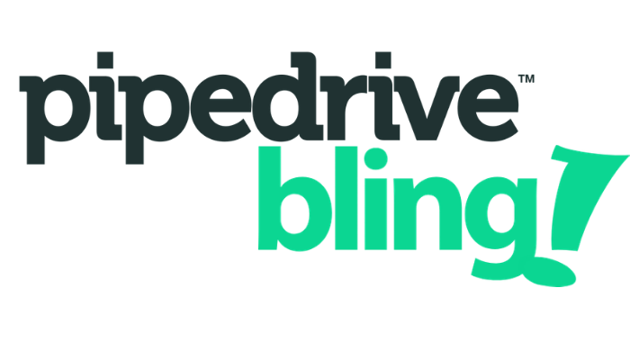

<p align="center">
  
  <p align="center">
    An integration system between Pipedrive and Bling
  </p>
  <p align="center">
    
    
    <a href="https://github.com/ianmateusES/pipedrive-bling/commits/master">
      
    </a>
    <a href="https://github.com/ianmateusES/pipedrive-bling/issues">
      
    </a>
    
  </p>
</p>


## About project
The project aims to integrate the [Bling](https://www.bling.com.br/home) and [Pipedrive](https://www.pipedrive.com/pt) platforms through a RESTFul API, saving Won Deals from the Pipedrive platform as Orders on the Bling platform, in addition to saving this information in a MongoDB collection.

## Requirements
- [Node v10+](https://nodejs.org/en/docs/) or [Docker](https://docs.docker.com/)/[Docker-Compose](https://docs.docker.com/compose/)
- [NPM](https://www.npmjs.com/) or [Yarn](https://classic.yarnpkg.com/en/docs/)
- KEY API on platforms [Bling](https://www.bling.com.br/home) and [Pipedrive](https://www.pipedrive.com/pt)

## Install the dependencies
- Using npm
  ```bash
    npm install
  ```
- Using yarn
  ```bash
    yarn
  ```

## Configuring mongodb
If you do not have a Mongo Atlas account, install a version of mongodb locally or use the docker.

If you have the docker, run the command:
```
docker run -d --name mongodb -p 27017:27017 mongo
```
To configure the connection URL (locally/docker or mongo atlas), just change in the  `.env` file the value of the `URL_CONNECT_MONGODB` property.
```
URL_CONNECT_MONGODB="mongodb://localhost:27017/pipedrivebling"
```

## Configuring pipedrive and bling API KEY
To obtain the API KEY in the Bling you will need to create an user API type and the token will automatically be displayed, [See this link](https://ajuda.bling.com.br/hc/pt-br/articles/360035558634-Usu%C3%A1rio-e-Usu%C3%A1rio-API).

At pipedrive, create an account and access this url `https://<your_company>.pipedrive.com/settings/api` by changing the value of `<your_company>` by what was generated to view the KEY API

With the two API KEY, just change the token fields of each service in the `.env` file:
```
PIPEDRIVE_API_KEY="api_key_pipedrive"
BLING_API_KEY="api_key_bling"
```

## Run the build command
```
yarn build
```

## Run the api
```
yarn start
```

## Starting with Docker-Compose
```
docker-compose up
```

## To run the documentation
Go to the `docs` directory and run:
```
yarn && yarn start
```
